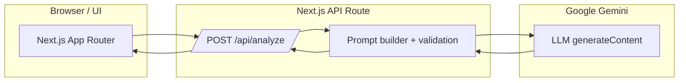
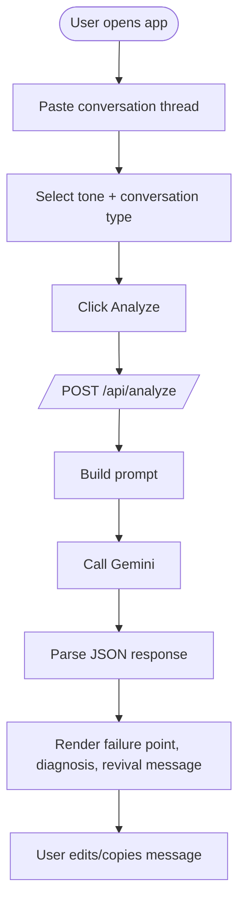
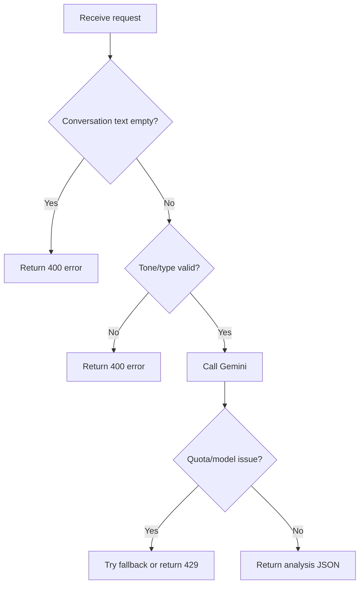

# Dead Thread Reviver

A concise, emotionally-aware single-page app that analyzes inactive conversation threads and suggests a natural, context-aware message to revive them.

## Why I built this (purpose)
- People often hesitate to restart a stalled conversation because they are not sure what to say.
- This project reduces that friction by offering one realistic, low-pressure message that fits the thread.
- It is built for networking, sales, recruiting, client, and personal conversations where tone matters.

## What it does
- Analyzes a thread to identify the failure point
- Explains why momentum dropped in one clear sentence
- Generates one sendable revival message in a selected tone

## Architecture (high level)



## System Design (components)
- Client UI: collects conversation, tone, and type; renders analysis cards
- API route: validates input, builds prompt, calls the model, returns JSON
- Model adapter: handles model selection, fallback, and JSON parsing
- Error handling: friendly messages for missing input, invalid tone/type, or quota issues

## Workflow Diagram (end-to-end path)



## Flowchart (decision points)



## Wire Diagram (lo-fi UI wireframe)

```
┌────────────────────────────────────────────────────────────┐
│ Dead Thread Reviver                                        │
│ Conversations usually don't die randomly.                  │
│ Paste a dead thread. Get one message to revive it.         │
├────────────────────────────────────────────────────────────┤
│ [Textarea: Paste conversation thread here...]              │
│                                                            │
│ Conversation Type: [Sales] [Networking] [Client] [...]     │
│ Tone: [Casual] [Confident] [Playful]                       │
│                                                            │
│ [ Analyze Conversation ]                                   │
├────────────────────────────────────────────────────────────┤
│ Where momentum dropped                                     │
│ [ failure_point text ]                                     │
├────────────────────────────────────────────────────────────┤
│ Why it died                                                │
│ [ diagnosis text ]                                         │
├────────────────────────────────────────────────────────────┤
│ Send this                                                  │
│ [ revival_message text ]   [ Copy ] [ Regenerate ]          │
└────────────────────────────────────────────────────────────┘
```

## Key files
- [app/page.tsx](app/page.tsx) — main entry UI
- [app/api/analyze/route.ts](app/api/analyze/route.ts) — server endpoint
- [lib/gemini.ts](lib/gemini.ts) — Gemini integration and fallback logic
- [components/dead-thread-reviver.tsx](components/dead-thread-reviver.tsx) — main UI component
- [components/theme-provider.tsx](components/theme-provider.tsx) — theme setup
- [components/theme-toggle.tsx](components/theme-toggle.tsx) — theme toggle

## Installation & Local Development
1. Install dependencies:

```powershell
npm install
```

2. Copy the environment template and add your API key:

```powershell
copy .env.example .env.local
# then open .env.local and set GOOGLE_GEMINI_API_KEY
```

3. Run the dev server:

```powershell
npm run dev
```

4. Open `http://localhost:3000` in your browser.

## Environment Variables
- `GOOGLE_GEMINI_API_KEY` — required (server-side)
- `GEMINI_MODEL` — optional; preferred model name (e.g., `gemini-2.5-flash`)

## API Contract
- Endpoint: `POST /api/analyze`
- Request JSON:

```json
{
  "conversation": "string",
  "tone": "Casual | Confident | Playful",
  "conversationType": "Sales | Networking | Client | Recruiting | Personal | Other"
}
```

- Response JSON:

```json
{
  "failure_point": "string",
  "diagnosis": "string",
  "revival_message": "string"
}
```

## Operational Notes
- API keys are stored server-side to avoid client exposure.
- Model fallback is used when a preferred model is unavailable or quota-limited.
- Conversation text is trimmed for safety before calling the model.

## Troubleshooting
- If you see `RESOURCE_EXHAUSTED` or quota errors, increase your Gemini quota or switch to a different model using `GEMINI_MODEL`.

## Contributing
- Fixes and improvements welcome. Open an issue or PR with a short description and reproduction steps.
